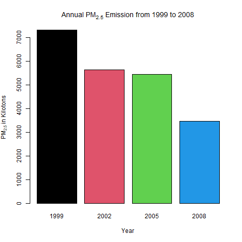
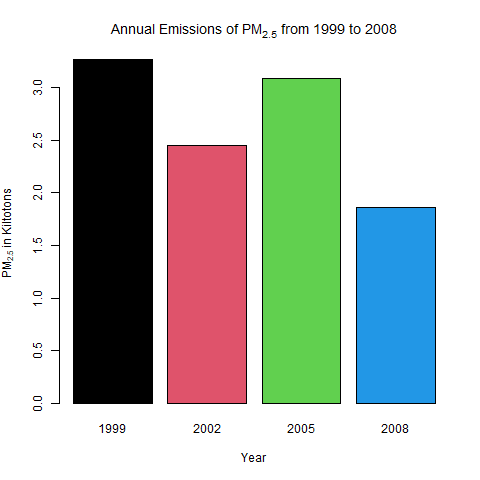
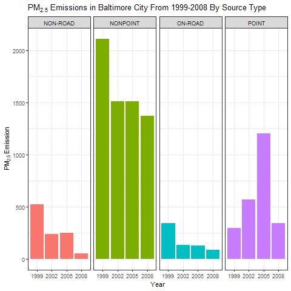
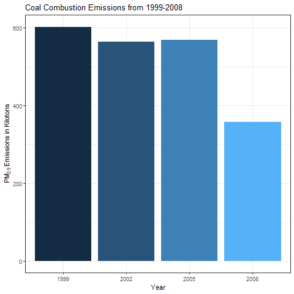
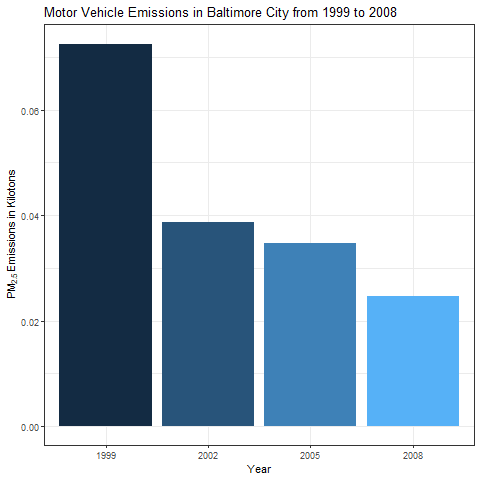
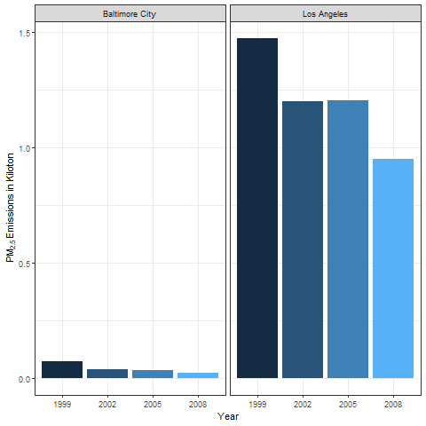

Exploratory Data Analysis - Course Project 2
============================================

# About
Fine particulate matter (PM2.5) is an ambient air pollutant for which there is strong evidence that it is harmful to human health. In the United States, the Environmental Protection Agency (EPA) is tasked with setting national ambient air quality standards for fine PM and for tracking the emissions of this pollutant into the atmosphere. Approximatly every 3 years, the EPA releases its database on emissions of PM2.5. This database is known as the National Emissions Inventory (NEI). You can read more information about the NEI at the [EPA National Emissions Inventory web site](http://www.epa.gov/ttn/chief/eiinformation.html).

For each year and for each type of PM source, the NEI records how many tons of PM2.5 were emitted from that source over the course of the entire year. The data that you will use for this assignment are for 1999, 2002, 2005, and 2008.

# Data
The data for this assignment are available from the course web site as a single zip file:
* [Data for Peer Assessment](https://d396qusza40orc.cloudfront.net/exdata%2Fdata%2FNEI_data.zip) [29Mb]
The zip file contains two files:

PM2.5 Emissions Data (`summarySCC_PM25.rds`): This file contains a data frame with all of the PM2.5 emissions data for 1999, 2002, 2005, and 2008. For each year, the table contains number of tons of PM2.5 emitted from a specific type of source for the entire year. Here are the first few rows.
```
##     fips      SCC Pollutant Emissions  type year
## 4  09001 10100401  PM25-PRI    15.714 POINT 1999
## 8  09001 10100404  PM25-PRI   234.178 POINT 1999
## 12 09001 10100501  PM25-PRI     0.128 POINT 1999
## 16 09001 10200401  PM25-PRI     2.036 POINT 1999
## 20 09001 10200504  PM25-PRI     0.388 POINT 1999
## 24 09001 10200602  PM25-PRI     1.490 POINT 1999
```
* `fips`: A five-digit number (represented as a string) indicating the U.S. county
* `SCC`: The name of the source as indicated by a digit string (see source code classification table)
* `Pollutant`: A string indicating the pollutant
* `Emissions`: Amount of PM2.5 emitted, in tons
* `type`: The type of source (point, non-point, on-road, or non-road)
* `year`: The year of emissions recorded

Source Classification Code Table (`Source_Classification_Code.rds`): This table provides a mapping from the SCC digit strings int he Emissions table to the actual name of the PM2.5 source. The sources are categorized in a few different ways from more general to more specific and you may choose to explore whatever categories you think are most useful. For example, source “10100101” is known as “Ext Comb /Electric Gen /Anthracite Coal /Pulverized Coal”.

You can read each of the two files using the `readRDS()` function in R. For example, reading in each file can be done with the following code:

```
## This first line will likely take a few seconds. Be patient!
NEI <- readRDS("summarySCC_PM25.rds")
SCC <- readRDS("Source_Classification_Code.rds")
```

as long as each of those files is in your current working directory (check by calling `dir()` and see if those files are in the listing).

# Assignment

The overall goal of this assignment is to explore the National Emissions Inventory database and see what it say about fine particulate matter pollution in the United states over the 10-year period 1999–2008. You may use any R package you want to support your analysis.

# Making and Submitting Plots

For each plot you should

* Construct the plot and save it to a PNG file.
* Create a separate R code file (plot1.R, plot2.R, etc.) that constructs the corresponding plot, i.e. code in plot1.R constructs the plot1.png plot. Your code file should include code for reading the data so that the plot can be fully reproduced. You should also include the code that creates the PNG file. Only include the code for a single plot (i.e. plot1.R should only include code for producing plot1.png)
* Upload the PNG file on the Assignment submission page
* Copy and paste the R code from the corresponding R file into the text box at the appropriate point in the peer assessment. 

# Data Source Preparation
The data files were downloaded as follows:
```
NEIfile <- "NEI_data.zip"

if (!file.exists(NEIfile)) {
  download_url <- "https://d396qusza40orc.cloudfront.net/exdata%2Fdata%2FNEI_data.zip"
  download.file(download_url, destfile = NEIfile)
}

if(!(file.exists("summarySCC_PM25.rds") && file.exists("Source_Classification_Code.rds"))) { 
    unzip(NEIfile) 
}

if (!exists("NEI")) {
  NEI <- readRDS("summarySCC_PM25.rds") 
}

if (!exists("SCC")) {
  SCC <- readRDS("Source_Classification_Code.rds")
}
```

# Questions
### Question 1
Have total emissions from PM2.5 decreased in the United States from 1999 to 2008? Using the base plotting system, make a plot showing the total PM2.5 emission from all sources for each of the years 1999, 2002, 2005, and 2008.

Aggregate total emissions of PM2.5 from all sources from 1999 to 2008. 
```{r Q1prep, cache=TRUE}
emissions_per_year <- aggregate(Emissions ~ year, NEI, FUN=sum)
```
Plot the total PM2.5 Emissions from all sources from 1999 to 2008.
```{r plot1}
barplot(emissions_per_year$Emissions/1000, names.arg=emissions_per_year$year, xlab="Year", 
        ylab=expression('PM'[2.5]*' in Kilotons'), main=expression('Annual PM'[2.5]*' Emission from 1999 to 2008'),
        col=as.factor(emissions_per_year$year))
```
From the following plot, we see total emissions from all sources have decreased from 1999 to 2008:



### Question 2
Have total emissions from PM2.5 decreased in the Baltimore City, Maryland ( fips == “24510”) from 1999 to 2008? Use the base plotting system to make a plot answering this question.

Filter out Baltimore City PM2.5 Emissions from 1999 to 2008. 

```{r Q2prep, cache=TRUE}
library("dplyr")
Baltimore_emissions <- NEI %>% filter(fips=="24510") %>% group_by(year) %>% summarise(Emissions=sum(Emissions))
```

Plot Baltimore City PM2.5 Emissions from 1999 to 2008.

```{r plot2}
barplot(Baltimore_emissions$Emissions/1000, names.arg=Baltimore_emissions$year, xlab="Year",
        ylab=expression('PM'[2.5]*' in Kiltotons'), main=expression('Annual Emissions of PM'[2.5]*' from 1999 to 2008'),
        col=as.factor(Baltimore_emissions$year))
```

From the following plot, overall Baltimore City's PM2.5 emissions have decreased from 1999 to 2008: 



### Question 3
Of the four types of sources indicated by the (point, nonpoint, onroad, nonroad) variable, which of these four sources have seen decreases in emissions from 1999-2008 for Baltimore City? Which have seen increases in emissions from 1999-2008? Use the ggplot2 plotting system to make a plot answer this question.

Filter out Baltimore City PM2.5 Emissions from 1999 to 2008. 

```{r Q3prep, cache=TRUE}
library("dplyr")
Baltimore_type_emissions <- NEI %>% filter(fips=="24510") %>% group_by(year, type) %>% summarise(Emissions=sum(Emissions))
png("plot3.png")
```

Plot Baltimore City PM2.5 Emissions from 1999 to 2008 split by types of sources. 

```{r plot3}
library("ggplot2")
b_t_plot <- ggplot(data=Baltimore_type_emissions, mapping=aes(x=factor(year), y=Emissions, fill=type)) +
  geom_bar(stat="identity") + facet_grid(.~type) + labs(x="Year",y=expression('PM'[2.5]*' Emission'), 
  title=expression('PM'[2.5]*' Emissions in Baltimore City From 1999-2008 By Source Type')) + theme_bw() + 
  theme(legend.position="none")

print(b_t_plot)
```

From the following plot, `NON-ROAD`, `NONPOINT`, `ON-ROAD`, and `POINT` source types have overall decreased emissions from 1999 to 2008 in Baltimore City : 



### Question 4
Across the United States, how have emissions from coal combustion-related sources changed from 1999 to 2008?

Filter out emmisions from coal combusted sources from 1999 to 2008 all across the United States.

```{r Q4prep, cache=TRUE}
library("dplyr")

#filter out SCC numbers containing coal in their short.name 
coal_SCC <- SCC[grep("coal", SCC$Short.Name, ignore.case=TRUE), "SCC"]
#Using SCC numbers matching coal, subset NEI SCC numbers matching coal_SCC SCC numbers
coal_nEI <- NEI %>% filter(SCC %in% coal_SCC) %>% group_by(year) %>% summarise(Emissions=sum(Emissions)) 
```

Plot coal combustion emission sources from 1999 to 2008. 

```{r plot4}
library("ggplot2")
coal_plot <- ggplot(coal_nEI, aes(x=factor(year), y=Emissions/1000, fill=year)) + geom_bar(stat="identity") +
  labs(x="Year", y=expression('PM'[2.5]*' Emissions in Kilotons'), title="Coal Combustion Emissions from 1999-2008") +
  theme_bw() + theme(legend.position = "none")
  
print(coal_plot)
```

From the following plot, coal combustion related sources have decreased from 1999 to 2008: 



### Question 5
How have emissions from motor vehicle sources changed from 1999 to 2008 in Baltimore City?

Filter out emisions from motor vehicle sources from 1999 to 2008 in Baltimore City.

```{r Q5prep, cache=TRUE}
library("dplyr")

#Filter out SCC numbers containing motor vehicle description in short.name
motor_vehicle_SCC <- SCC[grep("vehicle", SCC$Short.Name,ignore.case=TRUE), "SCC"]
#Filter out motor vehicles emissions from NEI using SCC numbers obtained from SCC db
motor_vehicle_NEI <- NEI %>% filter(SCC %in% motor_vehicle_SCC & fips == "24510") %>% group_by(year) %>%
  summarise(Emissions=sum(Emissions))
```

Plot motor vehicle emission sources from 1999 to 2008. 

```{r plot5}
library("ggplot2")
vehicle_plot <- ggplot(motor_vehicle_NEI, aes(x=factor(year), y=Emissions/1000, fill=year)) + geom_bar(stat="identity") +
  labs(x="Year", y=expression('PM'[2.5]*' Emissions in Kilotons'), title="Motor Vehicle Emissions in Baltimore City from 1999 to 2008") +
  theme_bw() + theme(legend.position = "none")
print(vehicle_plot)
```

From the following plot, motor vehicles emission soruces have decreased from 1999 to 2008: 



### Question 6
Compare emissions from motor vehicle sources in Baltimore City with emissions from motor vehicle sources in Los Angeles County, California ( == “06037”). Which city has seen greater changes over time in motor vehicle emissions?

Obtain SCC motor vehicle numbers to filter NEI database for vehicle SCCs, and Los Angeles and Baltimore counties motor vehicle emissions. 

```{r Q6prep, cache=TRUE}
library("dplyr")

#Obtain SCC motor vehicle codes from SCC db
vehicle_SCC <- SCC[grep("vehicle", SCC$Short.Name, ignore.case=TRUE), "SCC"]
#Filter out NEI motor vehicle
vehicle_emission <- NEI %>% filter(SCC %in% vehicle_SCC & fips %in% c("24510", "06037")) %>% group_by(fips, year) %>%
  summarise(Emissions=sum(Emissions)) 

#insert new variable (county) into database
vehicle_emission$county <- "Baltimore City"
vehicle_emission[grep("06037", vehicle_emission$fips),]$county <- "Los Angeles"
```

Plot motor vehicle emission sources from 1999 to 2008 for Los Angeles and Baltimore city. 

```{r plot6}
library("ggplot2")
county_plot <- ggplot(vehicle_emission, aes(x=factor(year), y=Emissions/1000, fill=year)) + geom_bar(stat="identity") +
  facet_grid(.~county) + labs(x="Year", y=expression('PM'[2.5]*' Emissions in Kiloton', title="Los Angeles vs Baltimore
  Vehicle Emissions")) + theme_bw() + theme(legend.position="none")
print(county_plot)
```

From the following plot, coal combustion related sources have decreased from 1999 to 2008: 



